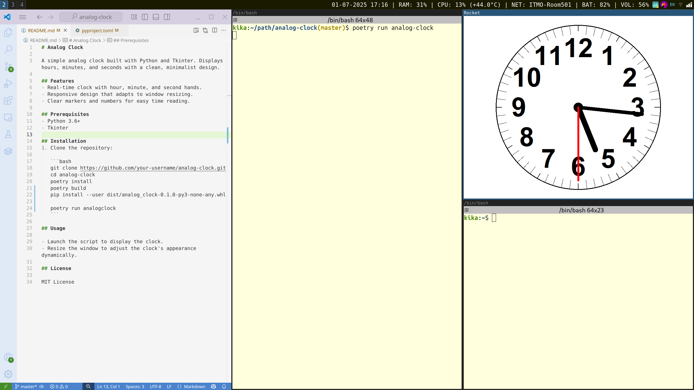

<!--  -->
<center></center>

# Analog Clock

A simple analog clock built with Python and Tkinter. Displays hours, minutes, and seconds with a clean, minimalist design.

## Features
- Real-time clock with hour, minute, and second hands.
- Responsive design that adapts to window resizing.
- Clear markers and numbers for easy time reading.

## Prerequisites
- Python 3.6+
- Tkinter

## Installation
1. Clone the repository:

   ```bash
   git clone https://github.com/your-username/analog-clock.git
   cd analog-clock
   poetry install
   poetry build
   pip install --user dist/analog_clock-0.1.0-py3-none-any.whl

   poetry run analogclock
   ```

## Usage

- Launch the script to display the clock.
- Resize the window to adjust the clock's appearance dynamically.

## License

MIT License